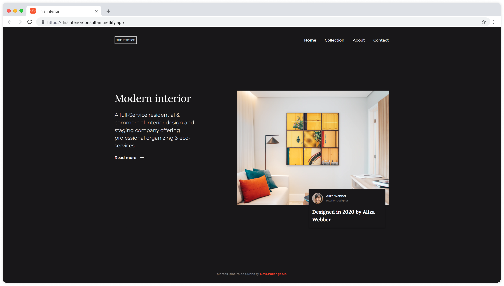
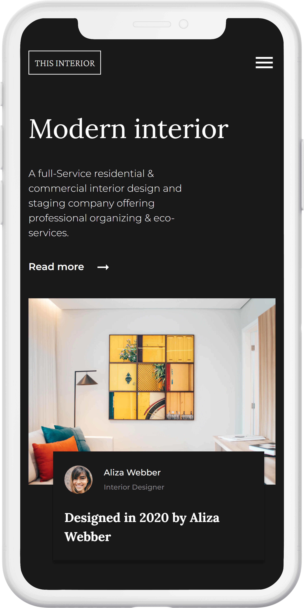

<h1 align="center">Interior Consultant</h1>

   Solution for a challenge from  <a href="http://devchallenges.io" target="_blank">Devchallenges.io</a>.

  <h3>
    <a href="https://thisinteriorconsultant.netlify.app">
      Demo
    </a>
     | 
    <a href="https://github.com/marcosribeirodacunha/dev-challenges-responsive-path/tree/master/interior-consultant">
      Solution
    </a>
     | 
    <a href="https://devchallenges.io/challenges/Jymh2b2FyebRTUljkNcb">
      Challenge
    </a>
  </h3>

## Table of Contents

- [Overview](#overview)
  - [Built With](#built-with)
- [Features](#features)
- [Acknowledgements](#acknowledgements)
- [Contact](#contact)

## Overview

   
  

### Built With

- [HTML](https://developer.mozilla.org/en-US/docs/Web/HTML)
- [CSS](https://developer.mozilla.org/en-US/docs/Web/CSS)
- [BEM methodology](http://getbem.com/)
- [SASS](https://sass-lang.com/)
- [Javascript](https://developer.mozilla.org/pt-BR/docs/Web/JavaScript)
- [Material Icons](https://material.io/resources/icons/?style=baseline)

## Features

This site was created as a submission to a [DevChallenges](https://devchallenges.io/challenges) challenge. The [challenge](https://devchallenges.io/challenges/Jymh2b2FyebRTUljkNcb) was to build a responsive page for a interior consultant following the user stories below:

- I can see a page following the given design
- On mobile, I can see a collapsed navigation
- On mobile, when I select the hamburger menu, I can see a navigation

## Acknowledgements

- [Live Sass Compiler](https://marketplace.visualstudio.com/items?itemName=ritwickdey.live-sass)

## Contact

- GitHub [@marcosribeirodacunha](https://github.com/marcosribeirodacunha)
- LinkedIn [@Marcos Ribeiro da Cunha](https://www.linkedin.com/in/marcos-ribeiro-da-cunha/)
