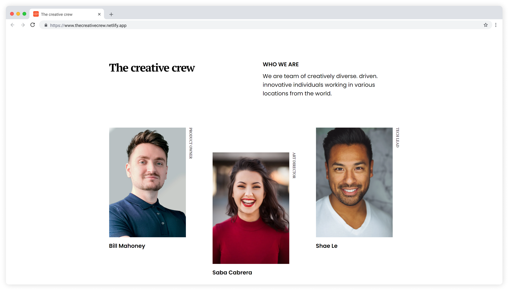
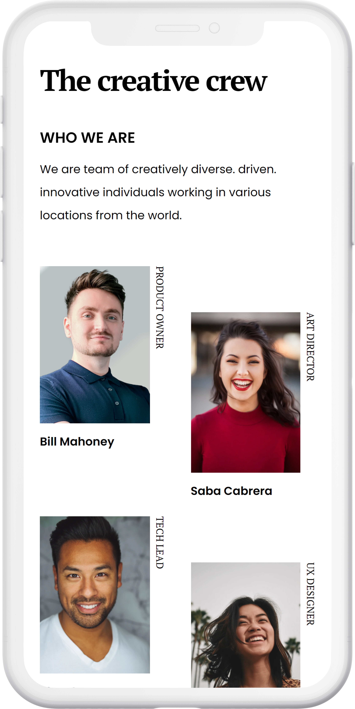

<h1 align="center">The creative crew</h1>

   Solution for a challenge from  <a href="http://devchallenges.io" target="_blank">Devchallenges.io</a>.

  <h3>
    <a href="https://thecreativecrew.netlify.app">
      Demo
    </a>
     | 
    <a href="https://github.com/marcosribeirodacunha/dev-challenges-responsive-path/tree/master/my-team-page">
      Solution
    </a>
     | 
    <a href="https://devchallenges.io/challenges/hhmesazsqgKXrTkYkt0U">
      Challenge
    </a>
  </h3>

## Table of Contents

- [Overview](#overview)
  - [Built With](#built-with)
- [Features](#features)
- [Contact](#contact)

## Overview

   
  

### Built With

- [HTML](https://developer.mozilla.org/en-US/docs/Web/HTML)
- [CSS](https://developer.mozilla.org/en-US/docs/Web/CSS)
- [BEM methodology](http://getbem.com/)

## Features

This site was created as a submission to a [DevChallenges](https://devchallenges.io/challenges) challenge. The [challenge](https://devchallenges.io/challenges/hhmesazsqgKXrTkYkt0U) was to build a **responsive team page**.

## Contact

- GitHub [@marcosribeirodacunha](https://github.com/marcosribeirodacunha)
- LinkedIn [@Marcos Ribeiro da Cunha](https://www.linkedin.com/in/marcos-ribeiro-da-cunha/)
