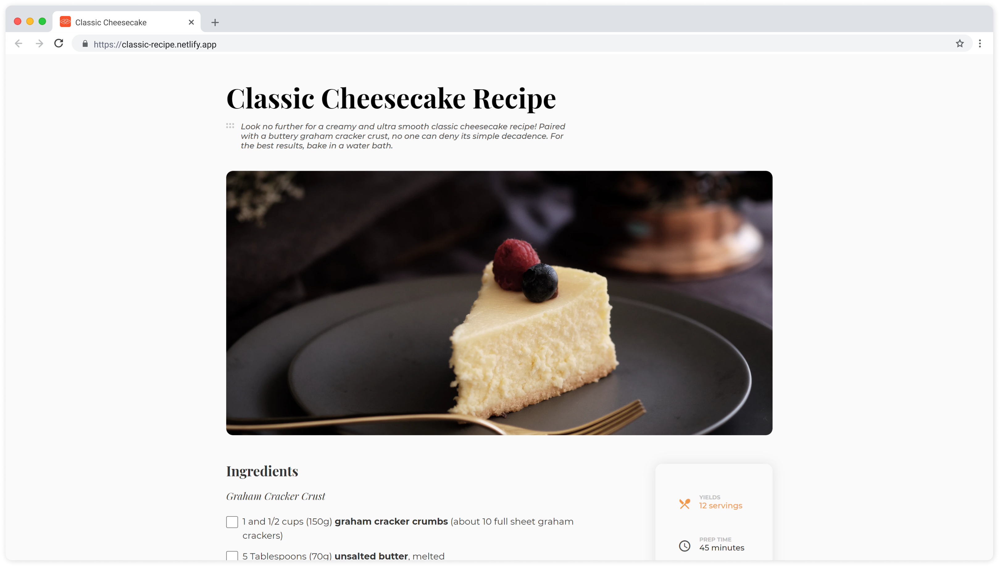
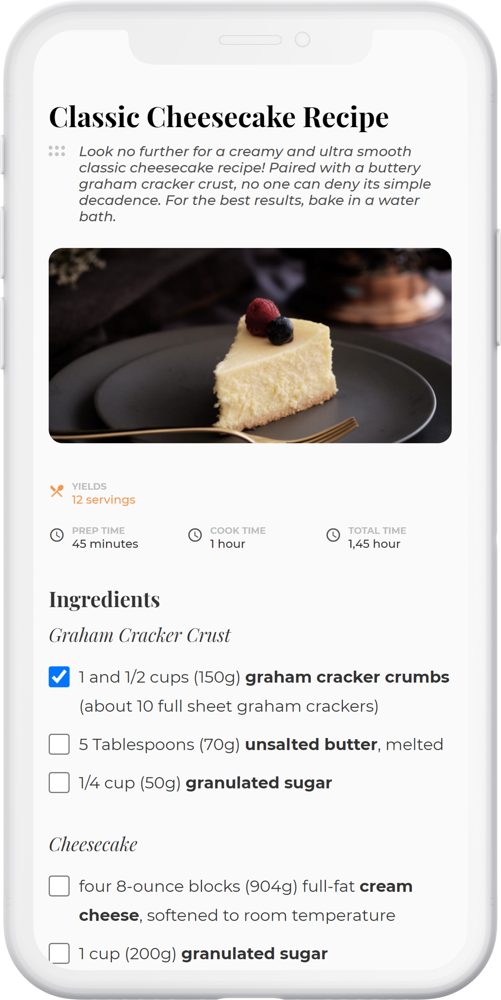

<h1 align="center">Recipe page</h1>

   Solution for a challenge from  <a href="http://devchallenges.io" target="_blank">Devchallenges.io</a>.

  <h3>
    <a href="https://classic-recipe.netlify.app/">
      Demo
    </a>
     | 
    <a href="https://github.com/marcosribeirodacunha/dev-challenges-responsive-path/tree/master/recipe-page">
      Solution
    </a>
     | 
    <a href="https://devchallenges.io/challenges/OEKdUZ6xs0h99C38XVht">
      Challenge
    </a>
  </h3>

## Table of Contents

- [Overview](#overview)
  - [Built With](#built-with)
- [Features](#features)
- [Acknowledgements](#acknowledgements)
- [Contact](#contact)

## Overview

   
  

### Built With

- [HTML](https://developer.mozilla.org/en-US/docs/Web/HTML)
- [CSS](https://developer.mozilla.org/en-US/docs/Web/CSS)
- [BEM methodology](http://getbem.com/)
- [SASS](https://sass-lang.com/)
- [Material Icons](https://material.io/resources/icons/?style=baseline)

## Features

This site was created as a submission to a [DevChallenges](https://devchallenges.io/challenges) challenge. The [challenge](https://devchallenges.io/challenges/TtUjDt19eIHxNQ4n5jps) was to build a responsive recipe page to complete the following user stories:

- [x] User story: I can see a recipe with ingredients and instructions
- [x] User story: I can select a checkbox if I have the ingredients
- [x] User story: I can see number of servings, baking times

## Acknowledgements

- [Custom List Number Styling](https://css-tricks.com/custom-list-number-styling/)
- [Live Sass Compiler](https://marketplace.visualstudio.com/items?itemName=ritwickdey.live-sass)

## Contact

- GitHub [@marcosribeirodacunha](https://github.com/marcosribeirodacunha)
- LinkedIn [@Marcos Ribeiro da Cunha](https://www.linkedin.com/in/marcos-ribeiro-da-cunha/)
